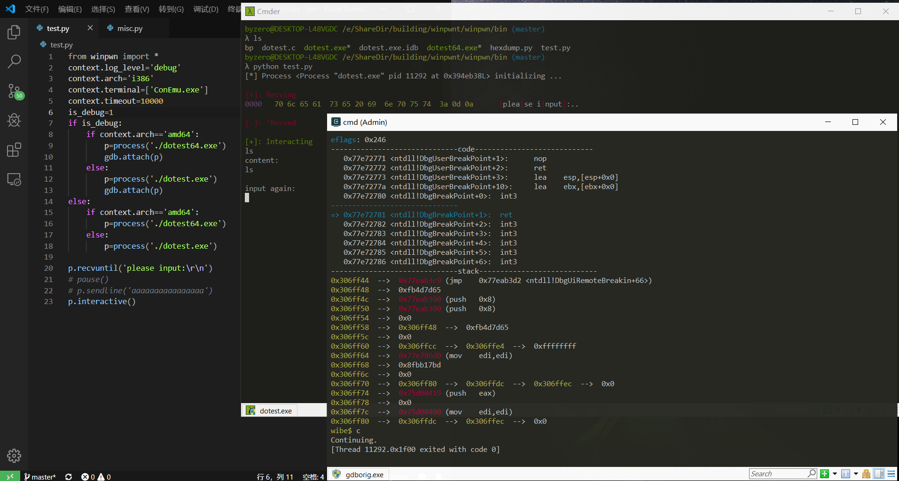
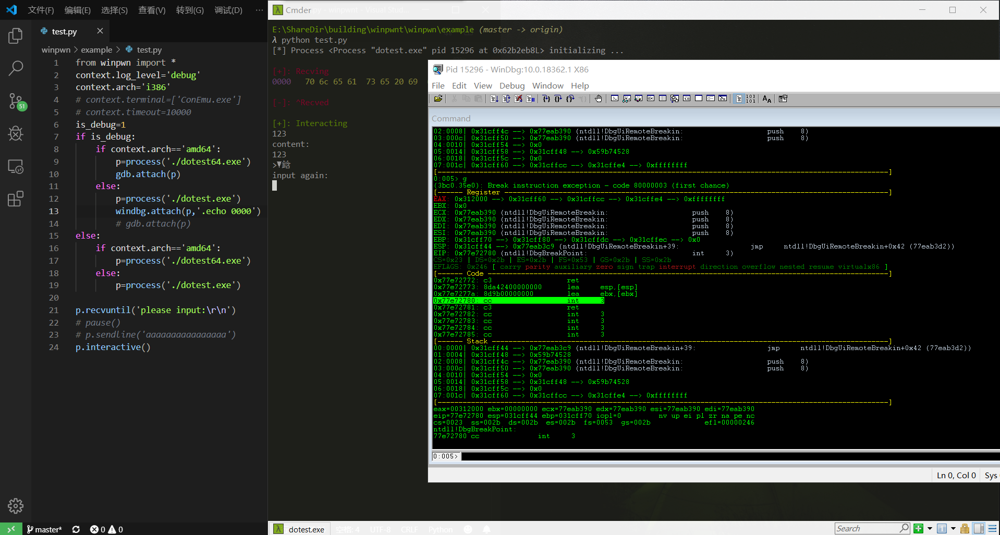

## winpwn: mini pwntools on windows
for CTF windows pwn

### pre
1. there are two versions of winpwn: winpwn-deps and winpwn-no-deps
2. for winpwn-deps: based on pwintools,but I complete the IO interactive and debug module
3. for winpwn-no-deps: written by myself. It just use ctypes to invoke Windows API. It supports python2.7 and python3

## install
1. if you want to debug, 
+ if you install by source code, modify the path of modify the PATH of debugger in <b>winpwn/var.py</b>
+ or if you use winpwn-nodeps, you can also create a json file in home dir(named ".winpwn"). Its content format refers winpwn-nodeps/.winpwn
2. I just test winpwn on cmder(if use cmder , please must use it on <b>"cmd::cmder as Admin"</b>, not bash)

### winpwn-deps(this veresion have a few bug, and I will not update thhis version)
1. git clone  https://github.com/Byzero512/winpwn.git
1. cd winpwn
1. pip install pythonforwindows
1. python setup.py install

### winpwn-nodeps

#### install from source code
1. git clone  https://github.com/Byzero512/winpwn.git
2. cd winpwn\winpwn-nodeps
3. python setup.py install / python3 setup.py install

#### pip
1. pip install winpwn 
2. or pip3 install winpwn

### usage

1. process

   1. process\("./pwn"\)
1. remote

   1. remote\("127.0.0.1", 65535\)
1. context

   1. context\.timeout=1000

   1. context\.debugger="gdb"

   1. context\.endian="little"

   1. context\.log\_level=""

   1. context\.terminal=\[ ]

   1. context\.newline="\r\n" 
1. dbg: gdb\(mingw gdb\), windbg, x64dbg

   1. gdb\.attach\(p, script="b \*0x401000"\)

   1. windbg\.attach\(p,script="bp 0x123456"\)

   1. x64dbg\.attach\(p\): can not parse script file yet

### configure
if you want to use debugger module, you need to deal with the deps yourself

#### mingw-gdb
for gdb-peda like show  as bellow, you need:
mingw-gdb installer: https://sourceforge.net/projects/mingw-w64/files/External%20binary%20packages%20%28Win64%20hosted%29/gdb/

1. https://github.com/Byzero512/wibe (a gdb-peda like gdb-script supports mingw-gdb on windows)
2. https://github.com/Byzero512/vmmap-win-cmd (for the command "vmmap" in wibe)

#### windbg
1. pykd
2. TWindbg: https://github.com/bruce30262/TWindbg

### demands
1. shellcode(I delete these funcitons exisit in pwintools, because I do not want to import too many deps)
2. complete debugger module for x64dbg (I have no good idea to wait for debugger to let it have enough time to execute the command when attach to it, and I am not familiar with x64dbg) 

## photos

### mingw gdb

### windbg

### x64dbg
not support {x64dbg.attach(p,"b*??")} yet
