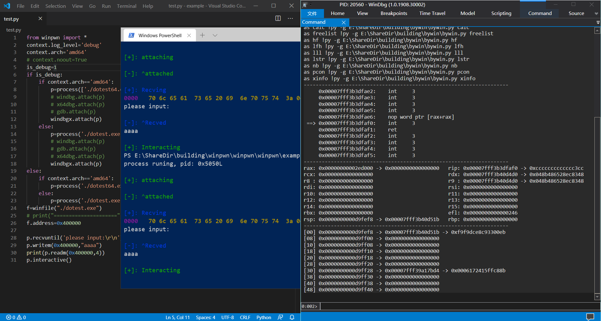

## winpwn: pwntools for windows
windows debug and exploit toolset for both user and kernel mode


### pre
1. support python2 and python3
2. support windbg/windbgx/x64dbg/mingw-gdb

### setup
1. pip/pip3 install winpwn
2. optional:
   + launch debugger: modify file [.winpwn](https://github.com/Byzero512/winpwn/blob/master/.winpwn) and copy it to windows <b>HOMEDIR</b>(python: `os.path.expanduser("~\\.winpwn")`)
   + pip install pefile
   + pip install keystone
   + pip install capstone

### usage

#### process
```python
process("./pwn")
process(["./pwn","argv[1]","argv[2]"])
p.readm(addr,n) # read process memory
p.writem(addr,con="") # write process memory
```

#### remote
```python
remote("127.0.0.1", 65535)
```

#### context
```python
context.timeout=512
context.debugger="gdb" # or "windbg" or "x64dbg" or "windbgx"
context.endian="little"
context.log_level="" # or "debug"
context.terminal=[ ]
context.newline="\r\n"
context.arch="i386" # or "amd64"
content.pie=None
context.dbginit=None # used to set debugger init script
context.windbg=None # set debugger path, or use .winpwn to find debugger path
context.windbgx=None
content.gdb=None
context.x64dbg=None
context.nocolor=None # if set, will print non-colorful output to terminal
```

#### dbg: windbgx or windbg
for details, take a look at [dbg](https://github.com/Byzero512/winpwn/blob/b77ee9b23e83ce6dff9869e0adb9d882c7c276bc/winpwn/dbg.py#L139)

```python
windbgx.attach(p,script="bp 0x401000") # debug local process
windbgx.remote("127.0.0.1,1234") # attach to dbgsrv to debug process remotely
windbgx.com(...) # debug kernel with serial port
windbgx.net(...) # debug kernel with kdnet
```

#### disable PIE:
```python
PIE(exe_fpath="")
NOPIE(exe_fpath="")
```

#### asm/disasm:
```python
asm("push ebp")
disasm("\x55")
```

#### winfile(fpath="./main.exe"):
```python
winfile.symbols["CreateProcessA"] # return symbol's IAT/EAT offset of CreateProcessA by image base
```

#### wincs(ip,port)
```python
wincs(ip=None,port=512) #run a server to asm/disasm in remote machine for client where does not install keystone/capstone
wincs(ip='123.123.123.123',512) # create a client to connet to server
wincs.asm(asmcode='push ebp')
wincs.disasm(machinecode='\x55')
```


### configure
if you want to use debugger like gdb-peda, you need to deal with the deps yourself

#### windbgx/windbg
1. [pykd](https://githomelab.ru/pykd/pykd)
2. [bywin](https://github.com/Byzero512/peda-windows/tree/master/windbg/bywin)

## photos

### windbgx/windbg


### refs
1. https://github.com/masthoon/pwintools
2. https://github.com/hakril/PythonForWindows
